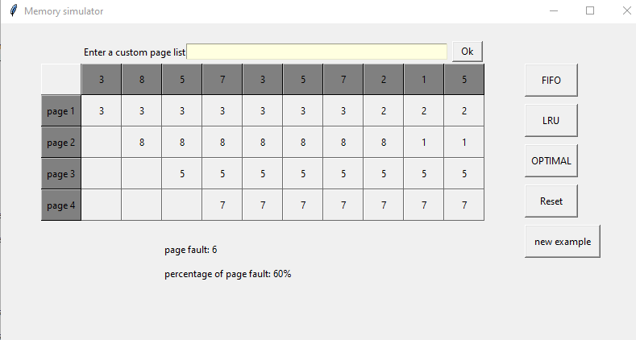
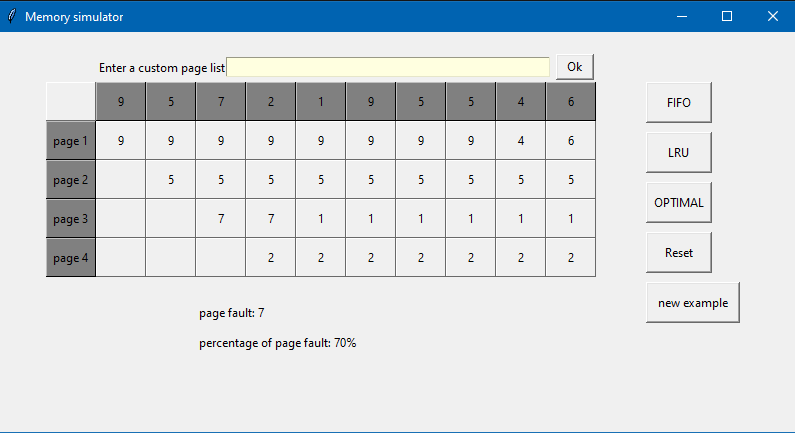

# Page replacement algorithms
In a computer operating system that uses paging for memmory management ,
page replacement algorithms decide which memory pages to page out if the memoryns full

## FIFO (first in first out)
This is the simplest page replacement algorithm,
when a page needs to be swapped in,the oldest page is in queue get swapped out

## LRU (Least recently used)
In this algorithm, when a page needs to be swapped in ,the least recently used page will be swapped out. 

## OPTIMAL
it is a theoretical algorithm  because it relies so much on the future,
algorithm  works as follows: when a page needs to be swapped in,
the OS swaps out the page whose next use will occur farthest in the future
